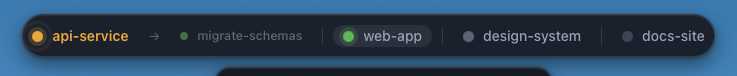
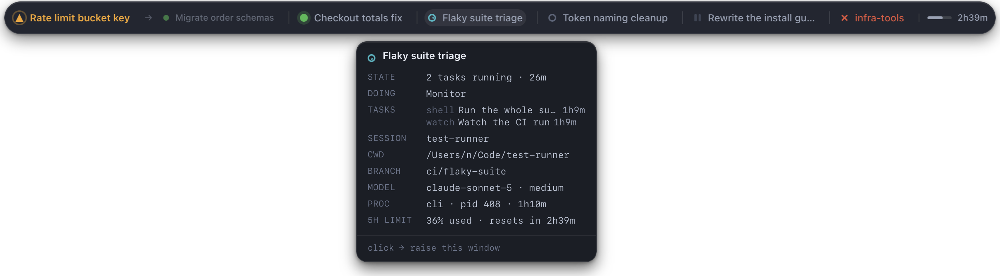

# clawde-buddy

A floating always-on-top macOS widget that shows what every local Claude Code session is doing, and tells you when one is waiting on you.


*All screenshots on this page use mocked session data.*

## Why

Run more than one Claude Code session and you lose track of them. A session that finishes, or blocks on a question or a permission prompt, does so silently in a window you are not looking at — and sits there until you happen to check. A menu-bar dot is no help: it is only visible when the menu bar is, and it collapses every session into one glyph.

clawde-buddy reads the session registry Claude Code already maintains and puts it somewhere you cannot miss.

## What you see

At rest, a small pill with counts. The amber chip is absent entirely when nothing needs you.


Hover it and the pill morphs into a named row, one dot per session.



Hover a name and a popover opens centred beneath it, with the working directory, git branch, model, effort, pid and uptime. Click it to bring that session's editor to the front.



| Colour | State |
|---|---|
| amber | waiting on you — carries the reason, e.g. `input needed` |
| green | working |
| grey | idle |
| dim grey | paused — quiet past the threshold, 10 minutes by default |
| red | died — the process is gone |

### Sessions, subagents and jobs

Background jobs and subagents appear **demoted** — dimmer and smaller — directly after the session that owns them, behind an arrow rather than a divider:

```
● api-service  →  ● migrate-schemas  |  ● web-app  |  ● design-system
```

They are matched to their parent by working directory, which is the only link the registry offers. They never count toward the session chips; they are summarised separately as `N jobs`. Turn them off entirely in Settings.

`sdk` entries — library callers such as plugin machinery — never appear, since you cannot answer them.

## Requirements

- macOS 13 or later
- Xcode Command Line Tools — `xcode-select --install`
- Node 20 or later
- Rust, via [rustup](https://rustup.rs)

## Install

Build it and copy it into Applications:

```bash
npm install
npm run tauri build
cp -R src-tauri/target/release/bundle/macos/clawde-buddy.app /Applications/
```

The build is unsigned, so Gatekeeper blocks the first launch: right-click the app in Finder, choose **Open**, and confirm. Once only. Opening it from the terminal will not get past that prompt.

For a distributable image instead, `npm run dmg` writes `dist-dmg/clawde-buddy_<version>_<arch>.dmg`.

### Development

```bash
npm run tauri dev
```

The frontend hot-reloads; Rust changes trigger a rebuild.

## Using it

There is **no Dock icon and no Cmd-Tab entry** — it is a menu-bar app. The tray icon is the only way in and the only way out:

- **Settings…** — opens a normal window: view mode, which display to use, paused threshold, per-alert toggles, sound, background jobs, launch at login
- **Mute alerts 1h**
- **View mode** — only the dot row is implemented so far
- **Quit**

It starts at the top centre of the primary display. Pick a different screen under Settings → *Show on display*, or drag the pill anywhere; positions are remembered per display, so docking and undocking a monitor puts it back where you left it rather than off-screen.

The widget floats above fullscreen apps and follows you across Spaces, and clicking it never takes focus from your editor.

### Alerts

macOS asks for notification permission on the first alert. Decline it and the pill flashes amber until you look at it instead — the signal is not lost.

**Alerts fire on transitions, not states.** A session that is already waiting when the widget starts stays silent, because the first reading is a baseline. Without that, every launch would open with a burst of alerts about things you already knew.

Only two transitions interrupt you: a session starting to wait for input, and a session dying. Finishing a turn and going idle is a colour change, nothing more.

### Settings file

`~/Library/Application Support/com.clawde.buddy/config.json` — plain JSON, hand-editable, every key optional:

```json
{
  "viewMode": "dotRow",
  "pausedThresholdMs": 600000,
  "alertNeedsInput": true,
  "alertDied": true,
  "sound": false,
  "muteUntilMs": 0,
  "launchAtLogin": false,
  "showBackgroundJobs": true,
  "preferredDisplay": null,
  "positions": {}
}
```

A corrupt or half-written file falls back to defaults rather than refusing to start.

## How it works

Three layers with enforced boundaries: a Rust watcher that owns the data, a Rust bridge for the two things a webview cannot do, and a React frontend that renders precomputed snapshots and derives nothing.

The data source is `~/.claude/sessions/<pid>.json`, the registry Claude Code maintains, plus the session transcript for fields the registry does not carry. clawde-buddy is **strictly read-only** against `~/.claude` — it never writes, moves or deletes anything there.

A few details that are less obvious than they look:

- **Liveness is `kill(pid, 0)` plus a process-start comparison**, because pid numbers get recycled. The comparison is one-sided: only a process *newer* than its registry entry indicates reuse. Claude Code adopts pre-forked spares, so an entry's `startedAt` can be hours after its process began.
- **Process start comes from elapsed time** (`ps -o etime=`), not from the registry's `procStart` string. That string is written in a different timezone than `ps -o lstart=` prints — two hours apart on a CEST machine — so comparing them marks every live session dead.
- **Only `cli` sessions report a status.** A `claude-desktop` entry has no `status` field at all, so for those the transcript's modification time stands in: touched within 30 seconds reads as working, and quiet time ages into idle and then paused.
- **FSEvents plus a 2-second reconcile tick.** FSEvents cannot report that a process died without its file changing, and it coalesces under load.
- **All mouse input is handled in Rust.** The widget is a non-activating `NSPanel`, which never becomes the key window, and WKWebView installs its mouse tracking as `activeInKeyWindow` — so the page receives no `mousemove`, no `:hover` and no `click`. Neither `-webkit-app-region` (Chromium-only) nor Tauri's `data-tauri-drag-region` works here. Instead the cursor and button state are sampled every 60ms and pushed to the page as window-local coordinates, which it hit-tests itself. Hover, the popover, click-to-raise and dragging all run through that.
- **The window never resizes while you interact with it.** It is sized to the widest state and reserves room for a popover, because resizing a transparent panel shows one unpainted frame — which, landing on the start of an animation, was the single largest source of visible stutter. The surrounding transparent margin is click-through so it cannot swallow a click meant for the app behind it.

Jumping to a session walks the process tree to the first executable inside a `.app`, reads its `CFBundleIdentifier`, and runs `open -b`. That needs neither Accessibility nor Automation permission, which is why a fresh install raises windows without prompting for anything.

## Limitations

- **App-level raise only.** Clicking a session brings its editor to the front, not the specific tab. VS Code-family editors expose no tab-targeting API.
- **One view mode.** The dot row. Card stack, character buddy and invisible-until-needed are specified and disabled.
- **Unsigned.** Gatekeeper prompts once per install. Distributing without that prompt needs an Apple Developer ID to sign and notarize.
- **A `claude-desktop` session inside a long tool call writes nothing** to its transcript, so it can read as idle until the result lands. It will not reach paused, which needs ten minutes of quiet.
- **Multi-display placement follows the primary display** by default; pick another in Settings if that is not the one you watch.

## Tests

```bash
npm test
```

```bash
cd src-tauri && cargo test -- --test-threads=1
```

167 Rust tests and 91 frontend tests. The Rust suite is weighted toward `watcher::state`, where every session state and transition is derived — that function is pure, with the clock, pid liveness and transcript activity all injected, so the whole state machine is tested without touching a filesystem. The watcher-loop tests use real files and real time, hence `--test-threads=1`.

Two environment variables point the widget at fixtures instead of live data, which is how the screenshots on this page were made:

```bash
CLAWDE_BUDDY_REGISTRY_DIR=/path/to/sessions CLAWDE_BUDDY_PROJECTS_DIR=/path/to/projects src-tauri/target/release/bundle/macos/clawde-buddy.app/Contents/MacOS/clawde-buddy
```

## Releasing

`npm run dmg` builds the installer image with `hdiutil`, deliberately not through Tauri's `dmg` bundler — that one drives Finder over AppleScript to arrange the window and times out without Automation permission, locally and in CI alike. The result installs identically, just without a custom background.

`.gitlab-ci.yml` builds and publishes on a tag: it runs the build, uploads the DMG to the Generic Packages registry and attaches it to a Release. A `.app` cannot be cross-compiled from Linux, so that job needs a macOS runner, and there are two ways to have one:

- **GitLab's hosted macOS runners** — Premium or Ultimate only; there is no free tier. Keep `MACOS_RUNNER_TAG` as shipped.
- **Your own Mac as a project runner** — free, and it already has the toolchain:

  ```bash
  brew install gitlab-runner
  gitlab-runner register --url https://gitlab.com --executor shell --tag-list macos
  brew services start gitlab-runner
  ```

  Then set `MACOS_RUNNER_TAG: macos` in `.gitlab-ci.yml`. A shell executor ignores `MACOS_IMAGE`.

Without any runner, build locally and run `GITLAB_TOKEN=... scripts/publish-release.sh v0.1.0`, which performs the same upload and release creation over the API.

## Design documents

The spec and implementation plan this was built from are kept in the repo:

- [Design spec](docs/superpowers/specs/2026-08-25-clawde-buddy-design.md)
- [Implementation plan](docs/superpowers/plans/2026-08-25-clawde-buddy-v1.md)
