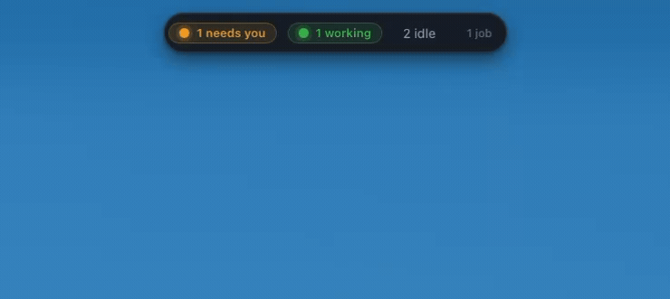
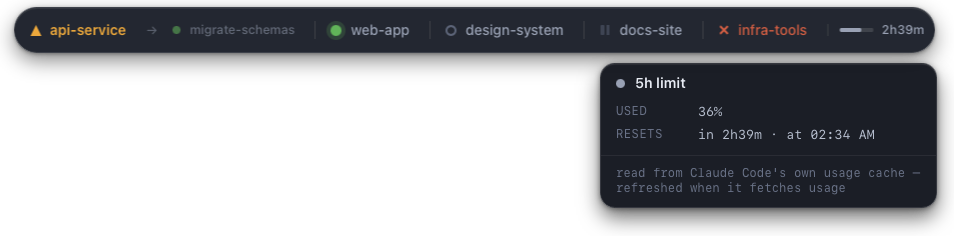
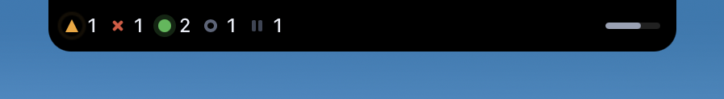

# claude-buddy

A floating always-on-top macOS widget that shows what every local Claude Code session is doing, and tells you when one is waiting on you.



*All screenshots on this page use mocked session data.*

## What leaves your machine

Nothing about your sessions. The widget reads Claude Code's own session
registry and transcripts from disk, read-only, and never sends any of it
anywhere — not the prose, not the project names, not the branches. The only
file it writes is its own settings file.

It makes two network requests, both to say what they are:

- **Anthropic's usage endpoint**, for the five-hour meter, every five minutes
  while that meter is switched on. It borrows the OAuth token Claude Code
  already holds and never writes one back; turn the meter off with `showUsage`
  and the requests stop with it. See [The five-hour limit](#the-five-hour-limit).
- **GitHub**, on launch, to ask whether there is a newer release. Nothing is
  installed without you choosing it from the tray menu.

One thing worth knowing rather than discovering: an alert about a session
waiting on you carries that session's actual pending question into macOS
Notification Center, so it can appear on a locked screen depending on your
notification settings. That is local to your Mac, but it is your work on
screen. [SECURITY.md](SECURITY.md) covers the rest of the picture.

## Why

Run more than one Claude Code session and you lose track of them. A session that finishes, or blocks on a question or a permission prompt, does so silently in a window you are not looking at — and sits there until you happen to check. A menu-bar dot is no help: it is only visible when the menu bar is, and it collapses every session into one glyph.

claude-buddy reads the session registry Claude Code already maintains and puts it somewhere you cannot miss.

## What you see

At rest, a small pill with counts. Each coloured chip carries the dot of the state it counts, and a chip is absent entirely when nothing is in that state — no amber when nothing needs you, no red when nothing has died. What is merely sitting there stays as quiet grey text.


Hover it and the pill morphs into a named row, one dot per session. Each one is labelled with what that session calls *itself* — the title Claude Code gives it, which says what the session is about rather than which folder it is in. Three sessions in one repository are three different labels rather than the same name three times. A session Claude Code has not titled yet falls back to its folder name, and a long title is clipped to keep the pill from growing across the screen.


A session that fires off a background test run, a dev server, a watch or a
background subagent goes quiet, and used to read `paused` after ten minutes —
indistinguishable from one nobody was driving. It now reads `tasking`, and the
collapsed pill counts it too, with a "1 on a task" chip between the working
chip and the died chip. The popover lists what it is waiting on: each running
task's kind, what it is, and how long it has been going. Registry jobs count
too, so a session waiting on one of those reads the same way whether or not
the job has a row of its own. When a task ends, a notification says which one
and how it went; turn that off with `alertTaskDone`.

Hover a name and a popover opens centred beneath it, headed by the session's full title, with the state and how long it has held, what the session is *doing* — the newest tool it reached for, or failing that the last thing it said — plus its registry name, the working directory, git branch, model, effort, entrypoint, pid and uptime. Click it to bring that session's editor to the front.


### Crazy mode

Off by default. Turned on in Settings, the widget stops being subtle about what it is already telling you.


- **Fire** — the pill warms as one session goes busy or tasking and is properly alight at three, with flames along its bottom edge and sparks coming off it. Background jobs and subagents do not count towards it — that is work you did not start — and neither does a registry job counted as one of your own tasks; only a task you launched yourself stokes it.
- **Shake** — a session that has been waiting on you for more than thirty seconds makes the pill tremble, harder the longer it waits, to a peak of 1.4px. It stops while the pointer is over the widget, so it never becomes a moving target.
- **Fracture** — as the five-hour limit runs down, cracks spread across the pill. At the last of it the limit bar goes molten and drips.
- **Ash** — a session dying breaks its dot apart once, and it settles back to the ordinary cross. Once, not forever: a dead session can sit in the row for hours.

Each of the four answers to its own signal, so the widget still says *which* thing is intense rather than only that something is.


Nothing animates while nothing is happening: an idle machine with crazy mode on costs exactly what an idle machine with it off costs. If your Mac is set to reduce motion, the colours and the cracks still ramp but nothing moves — no flames, no shake, no sparks.

Crazy mode applies to the floating widget. Notch placement is unaffected.

### The five-hour limit

The end of the row is Claude Code's own five-hour usage window: a bar of how much is left, and the share as a number. The bar warms to amber and then red as the window fills, and hovering it opens a popover with the reset time. Turn it off with `showUsage`.



The figure comes from the API, and only from there: the widget asks for it every five minutes with the same `GET /api/oauth/usage` Claude Code makes, using the OAuth token Claude Code already holds — read from `CLAUDE_CODE_OAUTH_TOKEN`, `~/.claude/.credentials.json` or the login Keychain. `showUsage` governs both halves; hide the meter and the requests stop with it.

There is no fallback to Claude Code's own cache of the figure in `~/.claude.json`. The widget used to read it and nothing else, which is why this changed: that cache is refreshed only when Claude Code fetches usage itself — in practice when someone opens its `/usage` panel — so it ran hours behind. Measured mid-session it said 5% where the API said 13%. A stale figure shown as though it were current is worse than no meter, so a failed call leaves no meter: the endpoint is private and undocumented, and every step of it is allowed to fail quietly. It also means the meter takes a few seconds to appear after launch, and never appears if no token can be read.

The token is borrowed, never managed: an expired one is a reason to skip a poll, not to run the refresh flow behind Claude Code's back. Nothing is written anywhere, and the first Keychain read may raise the system's own permission dialog. The meter disappears when the answer is not usable — a window that has already reset, a shape the response does not have any more, no token to ask with.

Every state carries a shape as well as a hue, because colour alone is unreadable to a red-green colourblind user and these six dots are the widget's whole vocabulary. The box stays 11px in each case, so nothing shifts as a session changes state.

| Colour | Shape | State |
|---|---|---|
| amber | triangle, inside a pulsing ring | waiting on you — carries the reason, e.g. `input needed` |
| green | filled circle with a glow | working |
| teal | hollow ring with a turning arc | waiting on a background task — carries what it is waiting for |
| grey | hollow ring | idle |
| dim grey | two-bar pause glyph | paused — quiet for ten minutes |
| red | cross | died — the process is gone |

### Sessions, subagents and jobs

Background jobs and subagents appear **demoted** — dimmer and smaller — directly after the session that owns them, behind an arrow rather than a divider:

```
● api-service  →  ● migrate-schemas  |  ● web-app  |  ● design-system
```

They are matched to their parent by working directory, which is the only link the registry offers. They never count toward the session chips; they are summarised separately as `N jobs`. Turn them off entirely in Settings.

`sdk` entries — library callers such as plugin machinery — never appear, since you cannot answer them.

## Notch mode

On a MacBook with a notch, the widget can live *in* the menu bar instead of floating below it. Settings → **Sit in the menu bar beside the notch**. The control is disabled on any other Mac.

At rest it is a black band the height of the menu bar, hugging the notch: session counts on the left of it, the five-hour limit's progress bar on the right. The notch is part of the band rather than a hole in it, so the three read as one shape.



Hover anywhere on the black and that same element grows — down and out to a third of the display's width — into a list of every session with its status and elapsed time, and the detail of the row under the cursor opens beneath it. There is no popover in this mode; the slab is wide enough to say everything the popover said. A tasking session's detail names what it is waiting on — the task's own name — the same way a waiting session's detail names its reason. Leave it and it collapses back into the menu bar.


Background agents are counted into the detail of the session that owns them rather than listed beside it — four agents rendered as four more rows buried the three sessions they belonged to.

The open width is a third of the display, bounded to 260–560pt. It does reach across the menu bar extras while open, which is deliberate: the resting band hugs its content and stays clear of them, so nothing sits over your clock unless the cursor is on the widget.

Notch placement takes the display choice out of your hands — the notch decides — so *Show on display* is disabled while it is on, and the widget cannot be dragged. Turn it off and the pill goes back where it was.

## Requirements

- macOS 13 or later
- Xcode Command Line Tools — `xcode-select --install`
- Node 20 or later
- Rust 1.77 or later, via [rustup](https://rustup.rs)

## Install

```bash
brew install --cask norbertsuski/tap/claude-buddy
```

Or take the DMG from the [latest release](https://github.com/norbertsuski/claude-buddy/releases/latest) and drag the app into Applications. Apple silicon, macOS 13 or later.

To build it yourself instead:

```bash
npm install
npm run tauri build
cp -R src-tauri/target/release/bundle/macos/claude-buddy.app /Applications/
```

However you install it, the app is not notarised, so Gatekeeper blocks the first launch. Try to open it, dismiss the warning, then go to **System Settings → Privacy & Security** and press **Open Anyway** in the block that has just appeared there. Once only. On macOS 14 and earlier, right-clicking the app and choosing **Open** does the same thing in one step. Opening it from the terminal will not get past either prompt.

For a distributable image instead, `npm run dmg` writes `dist-dmg/claude-buddy_<version>_<arch>.dmg`.

### Development

```bash
npm run tauri dev
```

The frontend hot-reloads; Rust changes trigger a rebuild. [CONTRIBUTING.md](CONTRIBUTING.md) has the fuller version — the layer boundaries the code is expected to keep, the test commands, and what CI will say about a pull request.

## Using it

There is **no Dock icon and no Cmd-Tab entry** — it is a menu-bar app. The tray icon is the only way in and the only way out:

- **About claude-buddy** — the standard macOS panel: icon, name, the version you are running, author, licence. With no Dock icon and no app menu there is nowhere else the app says which version it is.
- **Check for updates…** — asks, then says what it found either way: up to date, downloading, or why it could not. Once a check has found something newer the item renames itself to **Install update 0.8.0…**, naming the version, so the menu stops offering to check for what it has already found. Present only when the updater has a signing key configured; see [Signing updates](#signing-updates).
- **Hide widget** — a tick, not a policy: takes the widget off screen and keeps it there while sessions come and go. It outranks *Hide the widget* in Settings, including **Never**. For a screen share, a recording, or the ten minutes you want the corner of your display back.
- **Keep screen awake while agents work** — a tick that holds the display on for as long as a session is working, waiting on you, or on a background task. While it is actually holding, the item reads *Keeping screen awake now*, so the menu answers "is it doing anything right now" — on an idle machine, ticked, it does nothing at all. Off unless you turn it on. A long run is exactly when nobody is touching the keyboard, so the display sleeps on its idle timer and the answer — or the permission question that stopped the run — ends up behind a dark, locked screen. While this is ticked and something is actually working, **the Mac will not auto-lock**; the moment nothing is working it releases and normal sleep resumes. `pmset -g assertions` names the hold as *claude-buddy: agent working* if you want to see it. Background jobs count even when **Show background jobs** is off: a job with no row of its own still shows up as a task on the session that started it, so the display stays on while it runs.
- **Show background jobs** — the same tick as the Settings checkbox, where you need it: one run spawning six subagents is the moment you want them out of the row, and that moment does not wait for a settings window.
- **Mute alerts** — a submenu: **For 1 hour**, **For 8 hours**, or **Until I unmute**. While a mute is running the item reads *Alerts muted* and **Unmute now** inside it becomes clickable; it is greyed out the rest of the time, so the menu answers "am I muted" without your having to remember.
- **Settings…** — opens a normal window: when to hide the widget, which display to use, whether to sit in the notch, the sound and its four alert events, the 5h limit, background jobs, crazy mode, launch at login
- **Quit claude-buddy**

The toggles and the form write the same file, so a change made in either place shows up in the other immediately.


It starts at the top centre of the primary display. Pick a different screen under Settings → *Show on display*, or drag the pill anywhere; positions are remembered per display, so docking and undocking a monitor puts it back where you left it rather than off-screen.

The widget floats above fullscreen apps and follows you across Spaces, and clicking it never takes focus from your editor.

Settings → *Hide the widget* takes it off screen when there is nothing to watch: **Never**, **When there are no sessions** (the default), or **When nothing is waiting, working or on a task**. The tray menu's **Hide widget** is the manual version and beats all three — a session waking up will not bring the widget back while it is ticked. The tray icon stays either way, so a hidden widget is never unreachable.

### Alerts

macOS asks for notification permission on the first alert. Decline it and the pill flashes amber until you look at it instead — the signal is not lost.

**Alerts fire on transitions, not states.** A session that is already waiting when the widget starts stays silent, because the first reading is a baseline. Without that, every launch would open with a burst of alerts about things you already knew.

*Play a sound* is the switch for all of this, and the four things below sit under it in Settings. An alert is a notification with a sound, so silence means no alert: turning it off writes all four off and greys them out, and turning it back on restores the defaults. `notify::should_deliver` gates on it too, so a config file hand-edited to arm an event under a silent parent still delivers nothing.

Four things can interrupt you:

- **A session starts waiting for input.** The notification carries the session's actual pending question, read from its transcript — not just `input needed`. The registry's own reason stands in when the transcript yields nothing.
- **A session dies.** Its process is gone.
- **A background task finishes.** The notification names the task and says how it ended, so a failure does not read like a success. On by default; turn it off with the "when a background task finishes" checkbox, or with `alertTaskDone` in the settings file.
- **A session finishes its turn** — busy to idle. Off by default, since a finished turn is the common case and alerting on it is the noisy choice; enable it in Settings. Only that edge counts: answering a question and going quiet is not a finished turn, and a session first seen idle has finished nothing.

Each notification names the session the same way the row does: by its title, falling back to the folder-derived name for a session Claude Code has not titled.

Clicking any notification raises that session's window, the same as clicking its popover.

### Settings file

`~/Library/Application Support/com.claude.buddy/config.json` — plain JSON, hand-editable, every key optional:

```json
{
  "viewMode": "dotRow",
  "placement": "free",
  "alertNeedsInput": true,
  "alertDied": true,
  "alertFinished": false,
  "alertTaskDone": true,
  "sound": true,
  "muteUntilMs": 0,
  "launchAtLogin": false,
  "showBackgroundJobs": true,
  "showUsage": true,
  "hideWhen": "noSessions",
  "hidden": false,
  "keepAwake": false,
  "crazy": "off",
  "preferredDisplay": null,
  "positions": {}
}
```

`hideWhen` is one of `never`, `noSessions` or `nothingActive`; anything else falls back to showing the widget. `hidden` is the tray menu's **Hide widget** and is checked before `hideWhen` is even consulted, so `true` here hides the widget whatever the mode says — set it back to `false`, or untick the menu item, to get it back. `keepAwake` is the tray menu's **Keep screen awake**; it only has an effect while a session is working, waiting, or waiting on a background task, so `true` on an idle machine changes nothing. `crazy` is `off` or `ember`; anything else reads as `off`. It is the only setting that changes nothing about what the widget *knows* — only how loudly it says it. `muteUntilMs` is epoch milliseconds; the menu writes an hour or eight hours ahead for a timed mute, and `9223372036854775807` for *Until I unmute*. `placement` is `free` or `notch`; anything else reads as `free`, deliberately, since a hand-edited typo must not strand the widget in a placement it cannot be dragged out of. `viewMode` is vestigial — the view modes are gone, and the field is still parsed only so an existing config file keeps loading.

A corrupt or half-written file falls back to defaults rather than refusing to start.

## How it works

Three layers with enforced boundaries: a Rust watcher that owns the data, a Rust bridge for the two things a webview cannot do, and a React frontend that renders precomputed snapshots and derives nothing.

The data source is `~/.claude/sessions/<pid>.json`, the registry Claude Code maintains, plus the session transcript for fields the registry does not carry. claude-buddy is **strictly read-only** against `~/.claude` — it never writes, moves or deletes anything there.

A few details that are less obvious than they look:

- **Liveness is `kill(pid, 0)` plus a process-start comparison**, because pid numbers get recycled. The comparison is one-sided: only a process *newer* than its registry entry indicates reuse. Claude Code adopts pre-forked spares, so an entry's `startedAt` can be hours after its process began.
- **Process start comes from elapsed time** (`ps -o etime=`), not from the registry's `procStart` string. That string is written in a different timezone than `ps -o lstart=` prints — two hours apart on a CEST machine — so comparing them marks every live session dead.
- **Only `cli` sessions report a status.** A `claude-desktop` entry has no `status` field at all, so for those the transcript's modification time stands in: touched within 30 seconds reads as working, and quiet time ages into idle and then paused.
- **FSEvents plus a 2-second reconcile tick.** FSEvents cannot report that a process died without its file changing, and it coalesces under load.
- **All mouse input is handled in Rust.** The widget is a non-activating `NSPanel`, which never becomes the key window, and WKWebView installs its mouse tracking as `activeInKeyWindow` — so the page receives no `mousemove`, no `:hover` and no `click`. Neither `-webkit-app-region` (Chromium-only) nor Tauri's `data-tauri-drag-region` works here. Instead the cursor and button state are sampled every 60ms and pushed to the page as window-local coordinates, which it hit-tests itself. Hover, the popover, click-to-raise and dragging all run through that.
- **The window never resizes while you interact with it.** It is sized to the widest state and reserves room for a popover, because resizing a transparent panel shows one unpainted frame — which, landing on the start of an animation, was the single largest source of visible stutter. The surrounding transparent margin is click-through so it cannot swallow a click meant for the app behind it.

- **The notch's geometry comes from AppKit, once per change.** `safeAreaInsets.top` identifies a notched built-in display and `auxiliaryTopLeftArea` gives the usable flank; both are main-thread only, so the probe is cached and re-run by a 2-second watcher rather than answered live from a command. Closing the lid takes the notched display away entirely, and the widget has to stop drawing against a screen that is gone.

Jumping to a session walks the process tree to the first executable inside a `.app`, reads its `CFBundleIdentifier`, and runs `open -b`. That needs neither Accessibility nor Automation permission, which is why a fresh install raises windows without prompting for anything.

## Limitations

- **App-level raise only.** Clicking a session brings its editor to the front, not the specific tab. VS Code-family editors expose no tab-targeting API.
- **Unsigned.** The DMG carries an ad-hoc signature, which is what keeps Gatekeeper from calling the app *damaged*, but it is not a notarised one — so Gatekeeper still prompts once per install, and getting rid of that prompt needs an Apple Developer ID to sign and notarize. Update *delivery* is a separate matter and does work: configure a minisign key and the app updates itself in place from the tray menu — see [Signing updates](#signing-updates). With no key, as shipped, it never checks and never updates.
- **A `claude-desktop` session inside a long tool call writes nothing** to its transcript, so it can read as idle until the result lands. It will not reach paused, which needs ten minutes of quiet.
- **Multi-display placement follows the primary display** by default; pick another in Settings if that is not the one you watch.
- **Crazy mode does not reach notch mode.** The slab beside the notch is a different view with its own markup and scale, and none of the effects are drawn there. The setting stays where it is and takes effect again as soon as you go back to the floating widget.
- **Notch mode assumes the menu bar is where the menu bar is.** A fullscreen app, or *automatically hide and show the menu bar*, leaves the slab at the top edge over the app's own content. It also needs the notched built-in display: close the lid and the widget has nothing to sit in.

## Tests

```bash
npm test
```

```bash
cd src-tauri && cargo test -- --test-threads=1
```

289 Rust tests and 191 frontend tests. The Rust suite is weighted toward `watcher::state`, where every session state and transition is derived — that function is pure, with the clock, pid liveness and transcript activity all injected, so the whole state machine is tested without touching a filesystem. The watcher-loop tests use real files and real time, hence `--test-threads=1`.

Three environment variables point the widget at fixtures instead of live data, which is how the screenshots on this page were made — the third because the real usage file carries what the account has actually spent, which is neither reproducible nor anyone else's business. Setting `CLAUDE_BUDDY_USAGE_FILE` also stops the live call, which would otherwise put the real figure straight back on screen.

The fixture data is committed under `fixtures/`, and `scripts/dev-fixtures.sh` points `CLAUDE_BUDDY_REGISTRY_DIR`, `CLAUDE_BUDDY_PROJECTS_DIR` and `CLAUDE_BUDDY_USAGE_FILE` at it and launches the widget, so the screenshots above reproduce in one command:

```bash
scripts/dev-fixtures.sh        # npm run tauri dev
scripts/dev-fixtures.sh app    # the release bundle, already built
```

Half of the fixture is generated rather than committed, and the script regenerates it on every run. It has to: a session's state is derived from how long it has been quiet and from whether its pid is still alive, so a registry with timestamps frozen at the moment it was written reads as a row of paused, dead sessions a fortnight later. The transcripts are static — nothing in them is time-sensitive — and `fixtures/generate.sh` stamps the registry and the usage window fresh each time. One consequence worth knowing before you go looking for the red cross: the dead session ages off the row five minutes after the widget first sees it.

Set the three by hand instead if you would rather aim the widget at a registry of your own.

## Releasing

Tag and push; the release workflow builds the DMG on macOS, attaches it to a
GitHub release and publishes it.

The release body is the tag's own section of [CHANGELOG.md](CHANGELOG.md),
extracted by `scripts/release-notes.sh` — the same notes go into the updater's
`latest.json`, so the in-app update dialog says what changed too. Write the
section before tagging: a tag with no section still releases, but with nothing
but the download boilerplate in it.

```bash
scripts/release-notes.sh v0.4.0
```

### Building the image

`npm run dmg` builds the installer image with `hdiutil`, deliberately not through Tauri's `dmg` bundler — that one drives Finder over AppleScript to arrange the window and times out without Automation permission, locally and in CI alike. The result installs identically, just without a custom background.

### The macOS runner

A `.app` cannot be cross-compiled from Linux, so the release job needs a Mac. GitHub gives public repositories `macos-latest` runners at no cost, so there is nothing to arrange: the workflow asks for one and gets a clean machine with Xcode, Node and Rust already on it. Nothing to register, nothing to keep running, and nothing that has to be the maintainer's own laptop.

That the runner is disposable is what makes the rest of CI honest — see [Contributing](#contributing).

If you ever need to publish without the workflow, build locally and run `GITHUB_TOKEN=... scripts/publish-release.sh v0.1.0`, which creates the release and attaches the DMG over the API.

### Signing updates

The app checks for a newer release on launch and only tells you about it;
*Check for updates…* in the tray menu does the install. The updater refuses
anything it cannot verify, so a release needs a minisign keypair. This is
separate from Apple code signing — it secures the update channel, not
Gatekeeper.

```bash
npm run tauri signer generate -- -w ~/.tauri/claude-buddy.key
```

Put the printed public key in `src-tauri/tauri.conf.json` under
`plugins.updater.pubkey`, which ships empty, and add the private key and its
password to the repository under *Settings → Secrets and variables → Actions*,
both as repository secrets:

- `TAURI_SIGNING_PRIVATE_KEY` — the contents of `~/.tauri/claude-buddy.key`
- `TAURI_SIGNING_PRIVATE_KEY_PASSWORD` — the password you chose

`plugins.updater.endpoints` already points at the `latest.json` attached to
this project's newest release — a URL that stays the same as versions come and
go — so it needs no editing.

**No key is committed, so as shipped the updater is switched off**: with an
empty `pubkey` the plugin is never registered, so the launch check returns
without making any network call, the tray item is left out of the menu
entirely, and the app stays on the version you installed.

That keylessness is also why `bundle.createUpdaterArtifacts` is `false` here.
`tauri build` refuses to bundle an update tarball for a public key it cannot
also sign, so leaving it on would break `npm run tauri build` for anyone
without the private key. The release workflow turns it on for itself when
`TAURI_SIGNING_PRIVATE_KEY` is set, publishing `claude-buddy.app.tar.gz`, its
`.sig` and a `latest.json` manifest alongside the DMG; without the secrets it
skips all three and releases the DMG alone. To bundle a signed tarball by hand:

```bash
TAURI_SIGNING_PRIVATE_KEY=$(cat ~/.tauri/claude-buddy.key) \
  npm run tauri build -- --config '{"bundle":{"createUpdaterArtifacts":true}}'
```

## Design documents

The spec and implementation plans this was built from are kept in the repo:

- [Design spec](docs/superpowers/specs/2026-08-25-claude-buddy-design.md), and the [v2 design](docs/superpowers/specs/2026-08-25-claude-buddy-v2-design.md) that followed it
- [Notch mode design](docs/superpowers/specs/2026-08-26-notch-mode-design.md)
- Implementation plans, [v1](docs/superpowers/plans/2026-08-25-claude-buddy-v1.md) and [v2](docs/superpowers/plans/2026-08-25-claude-buddy-v2.md)

## Contributing

Contributions are welcome, under the same MIT terms as everything else here. [CONTRIBUTING.md](CONTRIBUTING.md) carries the setup and the conventions — how the three layers are meant to stay apart, and what a pull request is expected to arrive with. Anything that looks like a security problem goes the way [SECURITY.md](SECURITY.md) describes rather than into a public issue, so that a fix can land before the details do.

One thing about CI is worth knowing in advance, because it is the part people expect to be worse than it is: **every pull request runs the whole suite, forks included.** The Rust tests and clippy need macOS, and each run gets a fresh, disposable macOS runner, so there is no reason to hold them back from a branch nobody has read yet. A green run says what it looks like it says.

## License

MIT, copyright Norbert Suski. The full text is in [LICENSE](LICENSE).
